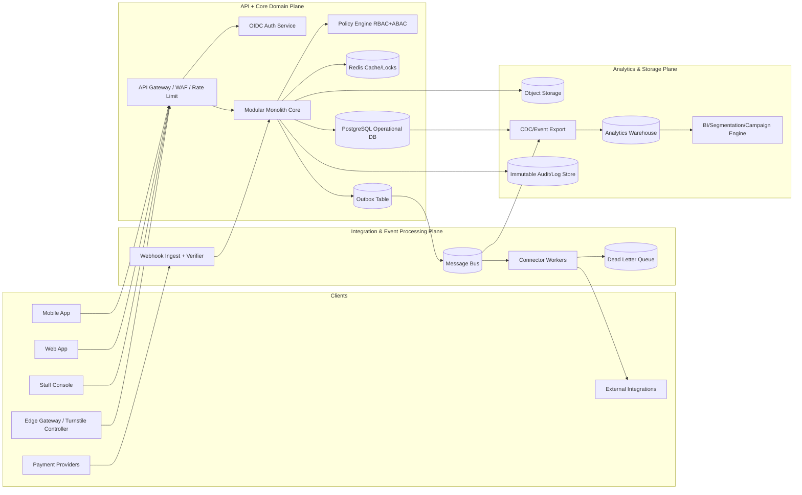
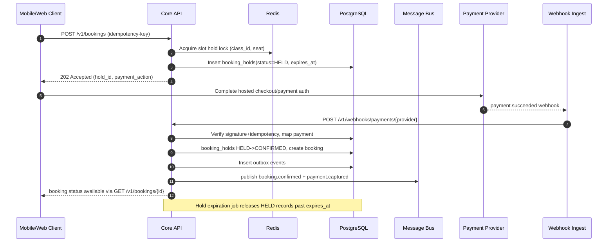
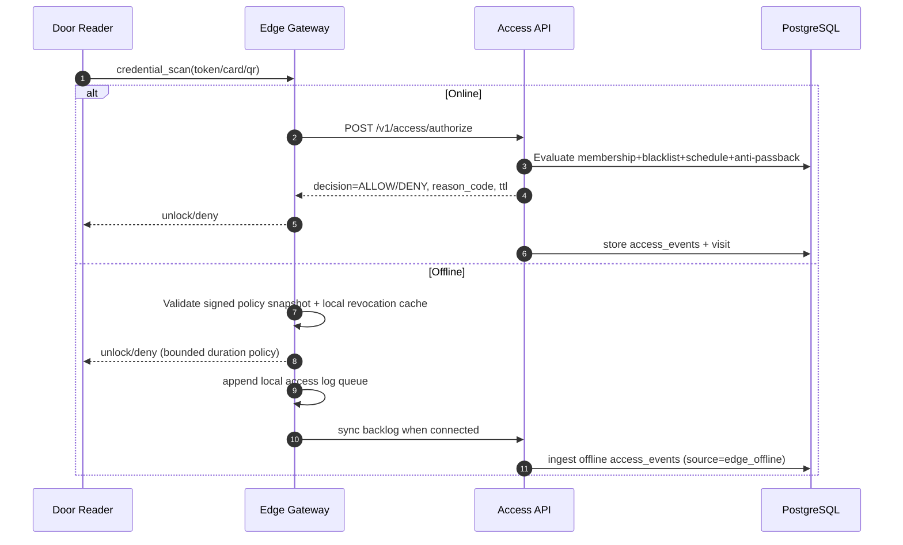
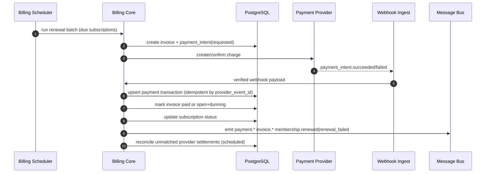

# Comprehensive Fitness and Gym Management System (Multi-Tenant SaaS, Event-Driven) — Technical Specification

## 1. Executive Summary

This specification defines a **multi-tenant, event-driven fitness and gym management platform** supporting membership operations, bookings, access control, billing, POS, integrations, and analytics at SaaS scale. The architecture is optimized for four distinct traffic shapes:

1. **High-frequency, low-latency access flows** (door/turnstile authorization and check-ins).
2. **High-write financial workflows** (subscriptions, invoices, POS, refunds, reconciliations).
3. **Bursty booking demand** (class release spikes, waitlist promotions, hold/confirm patterns).
4. **Analytics and marketing workloads** (segmentation, campaign orchestration, reporting).

The default deployment model is a **modular monolith for core business transactions** plus:
- a **separate integration/event-processing plane** (connectors, webhooks, retries, DLQ), and
- a **dedicated analytics pipeline** (CDC/events to warehouse).

This split minimizes distributed-transaction complexity in core flows while preserving independent scaling for integration and analytics. Core persistence uses PostgreSQL (system of record), Redis (low-latency cache, locks, idempotency accelerators), object storage (documents/artifacts), message bus (Kafka/SQS-equivalent), and a columnar warehouse (BigQuery/Snowflake-equivalent).

Security and compliance are first-class: OAuth2/OIDC/PKCE for web/mobile, tenant-scoped object-level authorization, OWASP ASVS + API Top 10 controls, PCI scope reduction through tokenization/hosted checkout/certified terminals, and privacy-by-design (data minimization, purpose limitation, retention/DSAR workflows).

The platform uses a canonical event model (`member.*`, `membership.*`, `booking.*`, `visit.*`, `access.*`, `invoice.*`, `payment.*`, `pos.*`) with explicit idempotency and correlation conventions to guarantee auditability and resilience under retries, duplicate webhooks, and partial failures.

Target non-functional goals:
- Access authorization p95 < 150 ms online; fallback authorization in offline edge mode.
- Booking API p95 < 300 ms at 95th percentile burst profile.
- Financial integrity with exactly-once-ish processing via idempotency keys, transactional outbox, and reconciliation jobs.
- Multi-tenant isolation by strict tenant scoping in schema, API, and policy engine.

---

## 2. System Topology



### 2.1 Topology Rationale
- **Core transactional boundaries** remain in one deployable unit (modular monolith) to ensure ACID integrity for booking, membership, and billing.
- **Outbox + bus** decouples side effects and external integrations from request latency.
- **Edge gateway** supports low-latency access and offline tolerance with signed policy snapshots.
- **Dedicated analytics plane** protects OLTP workload from heavy query scans.

---

## 3. Bounded Contexts / Modules

## 3.1 Core Domain Modules (inside modular monolith)
1. **Tenant & Organization Management**
   - Tenant provisioning, organizations (franchise/site), feature flags, plan limits.
2. **Identity & Access (IAM)**
   - User accounts, staff roles, member auth links, session/token metadata.
3. **Member Management**
   - Member profile, consent, emergency contact, medical flags, membership linkage.
4. **Membership & Subscription**
   - Plans, contracts, lifecycle (activate/freeze/cancel), billing cycles.
5. **Booking & Scheduling**
   - Classes, instructors, capacity, holds, confirmations, waitlists, attendance.
6. **Access Control & Visits**
   - Door authorization, check-in/check-out, anti-passback, access events.
7. **Billing, Invoicing & Payments**
   - Invoice generation, payment intents, webhook reconciliation, dunning.
8. **POS & Inventory Lite**
   - Orders, line items, terminal payments, refunds, stock adjustments (optional advanced inventory module).
9. **Notification Orchestration**
   - Templates, channel routing, event-triggered outbound requests.
10. **Audit & Compliance**
   - Immutable audit records, retention tags, legal holds.

## 3.2 Integration/Event Processing Modules (separate workers/services)
1. **Payment Provider Connectors** (Stripe/Adyen/etc abstraction)
2. **Messaging Connectors** (email/SMS/push)
3. **Webhook Gateway & Signature Verification**
4. **Retry/DLQ Processor with Replay Tooling**
5. **Partner Integrations** (accounting, CRM, hardware, ERP)

## 3.3 Analytics Modules (separate pipeline)
1. **CDC/Event Ingestion** (from outbox/bus + selected OLTP tables)
2. **Transform Layer** (bronze/silver/gold model)
3. **Semantic Metrics Layer** (MRR, churn, utilization, CAC/LTV)
4. **Segmentation & Campaign Audience Builder**

## 3.4 Module Ownership
- Core team owns canonical business rules and DB schema.
- Integration team owns connector adapters and retries.
- Data team owns warehouse models and reporting contracts.

---

## 4. Key Data Flows

## 4.1 Class Booking (Hold → Confirm + Payment Webhook)



## 4.2 Door Authorization (Online/Offline with Edge Gateway)



## 4.3 Subscription Renewal + Reconciliation via Webhooks



---

## 5. Canonical Event Catalog

> Envelope used by all domain events.

```json
{
  "event_id": "01J7WQ...ULID",
  "event_name": "booking.confirmed",
  "event_version": 1,
  "occurred_at": "2026-01-12T10:30:00Z",
  "tenant_id": "tnt_123",
  "organization_id": "org_456",
  "correlation_id": "corr_abc",
  "causation_id": "req_xyz",
  "idempotency_key": "idem_123",
  "actor": {
    "type": "member|staff|system|integration",
    "id": "mem_001"
  },
  "payload": {}
}
```

| Event Name | Producer | Primary Consumers | Idempotency Key | Retention | PII Class | Payload Schema (JSON excerpt) |
|---|---|---|---|---|---|---|
| `member.created` | Member module | CRM sync, analytics | `tenant_id:member_id` | 2y bus / 7y audit | PII-High | `{ "member_id":"...", "email":"...", "dob":"..." }` |
| `member.updated` | Member module | CRM, marketing suppression rules | `tenant_id:member_id:updated_at` | 2y/7y | PII-High | `{ "member_id":"...", "changed_fields":["phone"] }` |
| `member.consent.updated` | Member module | campaign engine | `tenant_id:member_id:consent_version` | 5y/7y | PII-Moderate | `{ "marketing_email":true, "sms":false }` |
| `membership.activated` | Membership module | access policy, analytics | `tenant_id:membership_id:activated_at` | 5y/7y | PII-Low | `{ "membership_id":"...", "plan_id":"..." }` |
| `membership.frozen` | Membership module | access control, billing | `tenant_id:membership_id:freeze_start` | 5y/7y | PII-Low | `{ "reason":"medical", "from":"...", "to":"..." }` |
| `membership.canceled` | Membership module | dunning stop, churn analytics | `tenant_id:membership_id:canceled_at` | 5y/7y | PII-Low | `{ "effective_at":"...", "reason_code":"cost" }` |
| `membership.renewed` | Billing module | analytics, notifications | `tenant_id:invoice_id` | 5y/7y | PII-Low | `{ "membership_id":"...", "invoice_id":"..." }` |
| `booking.hold.created` | Booking module | expiry worker, UX notifier | `tenant_id:hold_id` | 30d/2y | PII-Low | `{ "hold_id":"...", "class_id":"...", "expires_at":"..." }` |
| `booking.confirmed` | Booking module | attendance, notifications | `tenant_id:booking_id` | 2y/7y | PII-Low | `{ "booking_id":"...", "class_id":"...", "member_id":"..." }` |
| `booking.waitlisted` | Booking module | promotion worker | `tenant_id:waitlist_id` | 180d/2y | PII-Low | `{ "position":4 }` |
| `booking.canceled` | Booking module | waitlist worker, refunds | `tenant_id:booking_id:cancel_at` | 2y/7y | PII-Low | `{ "booking_id":"...", "canceled_by":"member" }` |
| `visit.checked_in` | Access module | attendance, analytics | `tenant_id:visit_id` | 2y/7y | PII-Low | `{ "visit_id":"...", "entry_point":"door_a" }` |
| `visit.checked_out` | Access module | analytics | `tenant_id:visit_id:checkout` | 2y/7y | PII-Low | `{ "visit_id":"...", "duration_sec":3600 }` |
| `access.authorization.requested` | Edge/API | SIEM, anomaly detection | `tenant_id:request_id` | 90d/1y | PII-Moderate | `{ "credential_hash":"...", "door_id":"..." }` |
| `access.authorization.granted` | Access module | SIEM, reporting | `tenant_id:access_event_id` | 90d/3y | PII-Moderate | `{ "reason_code":"active_membership" }` |
| `access.authorization.denied` | Access module | SIEM, support | `tenant_id:access_event_id` | 90d/3y | PII-Moderate | `{ "reason_code":"expired_membership" }` |
| `invoice.issued` | Billing module | accounting integration | `tenant_id:invoice_id` | 7y/10y | Financial | `{ "invoice_id":"...", "total":49.99, "currency":"USD" }` |
| `invoice.voided` | Billing module | accounting | `tenant_id:invoice_id:voided_at` | 7y/10y | Financial | `{ "void_reason":"duplicate" }` |
| `payment.intent.created` | Billing module | payment connector | `tenant_id:payment_intent_id` | 2y/7y | Financial | `{ "amount":49.99, "provider":"x" }` |
| `payment.captured` | Payment module | subscription state, receipts | `tenant_id:provider_txn_id` | 7y/10y | Financial | `{ "invoice_id":"...", "captured_amount":49.99 }` |
| `payment.failed` | Payment module | dunning workflows | `tenant_id:provider_txn_id:failed_at` | 7y/10y | Financial | `{ "failure_code":"insufficient_funds" }` |
| `payment.refunded` | Payment/POS module | accounting, notifications | `tenant_id:refund_id` | 7y/10y | Financial | `{ "original_payment_id":"...", "amount":20.00 }` |
| `pos.order.created` | POS module | inventory, analytics | `tenant_id:pos_order_id` | 2y/7y | Financial | `{ "order_id":"...", "gross_total":30.00 }` |
| `pos.order.paid` | POS module | receipts, accounting | `tenant_id:pos_order_id:paid_at` | 7y/10y | Financial | `{ "payment_id":"..." }` |
| `audit.recorded` | Audit module | compliance archive | `tenant_id:audit_log_id` | 10y | Sensitive | `{ "entity":"membership", "action":"cancel" }` |

### 5.1 Event Contract Rules
1. Versioned (`event_version`), backward-compatible additive changes only.
2. No raw PAN/card data in payloads.
3. PII fields marked by data classification registry.
4. Consumers must implement dedup using `event_id` + business idempotency key.

---

## 6. PostgreSQL Schema (Full DDL)

> Notes:
> - All tenant-scoped tables include `tenant_id` and often `organization_id`.
> - Use `gen_random_uuid()` (pgcrypto) for UUID PKs.
> - Use UTC timestamps (`timestamptz`).
> - Enforce scoped uniqueness with composite unique indexes.
> - Partition large append-only tables by month.

```sql
-- =====================================================================
-- 0) Extensions & Enums
-- =====================================================================
CREATE EXTENSION IF NOT EXISTS pgcrypto;
CREATE EXTENSION IF NOT EXISTS citext;

DO $$
BEGIN
  IF NOT EXISTS (SELECT 1 FROM pg_type WHERE typname = 'membership_status') THEN
    CREATE TYPE membership_status AS ENUM ('trial','active','frozen','canceled','expired');
  END IF;
  IF NOT EXISTS (SELECT 1 FROM pg_type WHERE typname = 'booking_status') THEN
    CREATE TYPE booking_status AS ENUM ('held','confirmed','waitlisted','canceled','expired');
  END IF;
  IF NOT EXISTS (SELECT 1 FROM pg_type WHERE typname = 'invoice_status') THEN
    CREATE TYPE invoice_status AS ENUM ('draft','issued','paid','partially_paid','void','overdue');
  END IF;
  IF NOT EXISTS (SELECT 1 FROM pg_type WHERE typname = 'payment_status') THEN
    CREATE TYPE payment_status AS ENUM ('requested','authorized','captured','failed','refunded','canceled');
  END IF;
  IF NOT EXISTS (SELECT 1 FROM pg_type WHERE typname = 'access_decision') THEN
    CREATE TYPE access_decision AS ENUM ('allow','deny');
  END IF;
  IF NOT EXISTS (SELECT 1 FROM pg_type WHERE typname = 'visit_status') THEN
    CREATE TYPE visit_status AS ENUM ('open','closed','invalid');
  END IF;
END $$;

-- =====================================================================
-- 1) Tenancy / Org / IAM
-- =====================================================================
CREATE TABLE tenants (
  id uuid PRIMARY KEY DEFAULT gen_random_uuid(),
  code text NOT NULL UNIQUE,
  name text NOT NULL,
  status text NOT NULL DEFAULT 'active' CHECK (status IN ('active','suspended','closed')),
  default_timezone text NOT NULL DEFAULT 'UTC',
  data_residency_region text,
  created_at timestamptz NOT NULL DEFAULT now(),
  updated_at timestamptz NOT NULL DEFAULT now(),
  created_by uuid,
  updated_by uuid
);

CREATE TABLE organizations (
  id uuid PRIMARY KEY DEFAULT gen_random_uuid(),
  tenant_id uuid NOT NULL REFERENCES tenants(id) ON DELETE CASCADE,
  code text NOT NULL,
  name text NOT NULL,
  parent_organization_id uuid REFERENCES organizations(id),
  timezone text NOT NULL DEFAULT 'UTC',
  currency char(3) NOT NULL,
  locale text NOT NULL DEFAULT 'en-US',
  is_active boolean NOT NULL DEFAULT true,
  created_at timestamptz NOT NULL DEFAULT now(),
  updated_at timestamptz NOT NULL DEFAULT now(),
  created_by uuid,
  updated_by uuid,
  UNIQUE (tenant_id, code)
);
CREATE INDEX idx_organizations_tenant ON organizations(tenant_id);

CREATE TABLE users (
  id uuid PRIMARY KEY DEFAULT gen_random_uuid(),
  tenant_id uuid NOT NULL REFERENCES tenants(id) ON DELETE CASCADE,
  organization_id uuid REFERENCES organizations(id),
  external_subject text,
  email citext NOT NULL,
  phone text,
  full_name text NOT NULL,
  status text NOT NULL DEFAULT 'active' CHECK (status IN ('active','invited','disabled')),
  last_login_at timestamptz,
  created_at timestamptz NOT NULL DEFAULT now(),
  updated_at timestamptz NOT NULL DEFAULT now(),
  created_by uuid,
  updated_by uuid,
  UNIQUE (tenant_id, email),
  UNIQUE (tenant_id, external_subject)
);
CREATE INDEX idx_users_tenant_org ON users(tenant_id, organization_id);

CREATE TABLE roles (
  id uuid PRIMARY KEY DEFAULT gen_random_uuid(),
  tenant_id uuid NOT NULL REFERENCES tenants(id) ON DELETE CASCADE,
  code text NOT NULL,
  name text NOT NULL,
  is_system boolean NOT NULL DEFAULT false,
  created_at timestamptz NOT NULL DEFAULT now(),
  updated_at timestamptz NOT NULL DEFAULT now(),
  UNIQUE (tenant_id, code)
);

CREATE TABLE user_roles (
  id uuid PRIMARY KEY DEFAULT gen_random_uuid(),
  tenant_id uuid NOT NULL REFERENCES tenants(id) ON DELETE CASCADE,
  user_id uuid NOT NULL REFERENCES users(id) ON DELETE CASCADE,
  role_id uuid NOT NULL REFERENCES roles(id) ON DELETE CASCADE,
  organization_id uuid REFERENCES organizations(id),
  created_at timestamptz NOT NULL DEFAULT now(),
  created_by uuid,
  UNIQUE (tenant_id, user_id, role_id, organization_id)
);

-- =====================================================================
-- 2) Members / Consent / Credentials
-- =====================================================================
CREATE TABLE members (
  id uuid PRIMARY KEY DEFAULT gen_random_uuid(),
  tenant_id uuid NOT NULL REFERENCES tenants(id) ON DELETE CASCADE,
  organization_id uuid NOT NULL REFERENCES organizations(id),
  member_no text NOT NULL,
  first_name text NOT NULL,
  last_name text NOT NULL,
  email citext,
  phone text,
  date_of_birth date,
  gender text,
  emergency_contact_name text,
  emergency_contact_phone text,
  medical_notes text,
  status text NOT NULL DEFAULT 'active' CHECK (status IN ('prospect','active','inactive','blacklisted')),
  joined_at timestamptz,
  source text,
  tags text[] NOT NULL DEFAULT '{}',
  created_at timestamptz NOT NULL DEFAULT now(),
  updated_at timestamptz NOT NULL DEFAULT now(),
  created_by uuid,
  updated_by uuid,
  request_id text,
  correlation_id text,
  UNIQUE (tenant_id, member_no),
  UNIQUE (tenant_id, email)
);
CREATE INDEX idx_members_tenant_org_status ON members(tenant_id, organization_id, status);
CREATE INDEX idx_members_tenant_phone ON members(tenant_id, phone);

CREATE TABLE member_addresses (
  id uuid PRIMARY KEY DEFAULT gen_random_uuid(),
  tenant_id uuid NOT NULL REFERENCES tenants(id) ON DELETE CASCADE,
  member_id uuid NOT NULL REFERENCES members(id) ON DELETE CASCADE,
  line1 text NOT NULL,
  line2 text,
  city text NOT NULL,
  state text,
  postal_code text,
  country char(2) NOT NULL,
  is_primary boolean NOT NULL DEFAULT true,
  created_at timestamptz NOT NULL DEFAULT now(),
  updated_at timestamptz NOT NULL DEFAULT now(),
  UNIQUE (tenant_id, member_id, is_primary) DEFERRABLE INITIALLY DEFERRED
);
CREATE INDEX idx_member_addresses_member ON member_addresses(tenant_id, member_id);

CREATE TABLE member_consents (
  id uuid PRIMARY KEY DEFAULT gen_random_uuid(),
  tenant_id uuid NOT NULL REFERENCES tenants(id) ON DELETE CASCADE,
  member_id uuid NOT NULL REFERENCES members(id) ON DELETE CASCADE,
  consent_type text NOT NULL,
  granted boolean NOT NULL,
  granted_at timestamptz,
  revoked_at timestamptz,
  source text NOT NULL,
  policy_version text,
  created_at timestamptz NOT NULL DEFAULT now(),
  updated_at timestamptz NOT NULL DEFAULT now(),
  created_by uuid,
  UNIQUE (tenant_id, member_id, consent_type)
);

CREATE TABLE member_credentials (
  id uuid PRIMARY KEY DEFAULT gen_random_uuid(),
  tenant_id uuid NOT NULL REFERENCES tenants(id) ON DELETE CASCADE,
  member_id uuid NOT NULL REFERENCES members(id) ON DELETE CASCADE,
  credential_type text NOT NULL CHECK (credential_type IN ('qr','nfc_card','biometric_token','mobile_token')),
  credential_ref text NOT NULL,
  credential_hash text NOT NULL,
  status text NOT NULL DEFAULT 'active' CHECK (status IN ('active','revoked','expired')),
  issued_at timestamptz NOT NULL DEFAULT now(),
  expires_at timestamptz,
  last_used_at timestamptz,
  created_at timestamptz NOT NULL DEFAULT now(),
  updated_at timestamptz NOT NULL DEFAULT now(),
  UNIQUE (tenant_id, credential_hash),
  UNIQUE (tenant_id, member_id, credential_type, credential_ref)
);
CREATE INDEX idx_member_credentials_lookup ON member_credentials(tenant_id, credential_hash, status);

-- =====================================================================
-- 3) Membership Plans / Subscriptions
-- =====================================================================
CREATE TABLE membership_plans (
  id uuid PRIMARY KEY DEFAULT gen_random_uuid(),
  tenant_id uuid NOT NULL REFERENCES tenants(id) ON DELETE CASCADE,
  organization_id uuid REFERENCES organizations(id),
  code text NOT NULL,
  name text NOT NULL,
  description text,
  billing_interval text NOT NULL CHECK (billing_interval IN ('day','week','month','year')),
  billing_interval_count int NOT NULL DEFAULT 1 CHECK (billing_interval_count > 0),
  price_amount numeric(12,2) NOT NULL CHECK (price_amount >= 0),
  currency char(3) NOT NULL,
  signup_fee_amount numeric(12,2) NOT NULL DEFAULT 0 CHECK (signup_fee_amount >= 0),
  max_freeze_days_per_year int NOT NULL DEFAULT 0,
  cancellation_notice_days int NOT NULL DEFAULT 0,
  is_active boolean NOT NULL DEFAULT true,
  created_at timestamptz NOT NULL DEFAULT now(),
  updated_at timestamptz NOT NULL DEFAULT now(),
  created_by uuid,
  updated_by uuid,
  UNIQUE (tenant_id, code)
);
CREATE INDEX idx_membership_plans_tenant_active ON membership_plans(tenant_id, is_active);

CREATE TABLE memberships (
  id uuid PRIMARY KEY DEFAULT gen_random_uuid(),
  tenant_id uuid NOT NULL REFERENCES tenants(id) ON DELETE CASCADE,
  organization_id uuid NOT NULL REFERENCES organizations(id),
  member_id uuid NOT NULL REFERENCES members(id),
  plan_id uuid NOT NULL REFERENCES membership_plans(id),
  contract_no text,
  status membership_status NOT NULL,
  start_date date NOT NULL,
  end_date date,
  next_billing_date date,
  auto_renew boolean NOT NULL DEFAULT true,
  cancel_requested_at timestamptz,
  canceled_at timestamptz,
  canceled_reason_code text,
  freeze_from date,
  freeze_to date,
  freeze_reason text,
  payment_method_token_id uuid,
  created_at timestamptz NOT NULL DEFAULT now(),
  updated_at timestamptz NOT NULL DEFAULT now(),
  created_by uuid,
  updated_by uuid,
  request_id text,
  correlation_id text,
  UNIQUE (tenant_id, contract_no)
);
CREATE INDEX idx_memberships_member_status ON memberships(tenant_id, member_id, status);
CREATE INDEX idx_memberships_next_billing ON memberships(tenant_id, next_billing_date) WHERE status IN ('active','trial','frozen');

CREATE TABLE membership_freezes (
  id uuid PRIMARY KEY DEFAULT gen_random_uuid(),
  tenant_id uuid NOT NULL REFERENCES tenants(id) ON DELETE CASCADE,
  membership_id uuid NOT NULL REFERENCES memberships(id) ON DELETE CASCADE,
  freeze_from date NOT NULL,
  freeze_to date NOT NULL,
  reason_code text,
  approved_by uuid REFERENCES users(id),
  created_at timestamptz NOT NULL DEFAULT now(),
  updated_at timestamptz NOT NULL DEFAULT now(),
  CHECK (freeze_to >= freeze_from)
);
CREATE INDEX idx_membership_freezes_membership ON membership_freezes(tenant_id, membership_id, freeze_from);

-- =====================================================================
-- 4) Scheduling / Booking / Attendance
-- =====================================================================
CREATE TABLE facilities (
  id uuid PRIMARY KEY DEFAULT gen_random_uuid(),
  tenant_id uuid NOT NULL REFERENCES tenants(id) ON DELETE CASCADE,
  organization_id uuid NOT NULL REFERENCES organizations(id),
  code text NOT NULL,
  name text NOT NULL,
  timezone text NOT NULL,
  address_json jsonb,
  is_active boolean NOT NULL DEFAULT true,
  created_at timestamptz NOT NULL DEFAULT now(),
  updated_at timestamptz NOT NULL DEFAULT now(),
  UNIQUE (tenant_id, code)
);

CREATE TABLE classes (
  id uuid PRIMARY KEY DEFAULT gen_random_uuid(),
  tenant_id uuid NOT NULL REFERENCES tenants(id) ON DELETE CASCADE,
  organization_id uuid NOT NULL REFERENCES organizations(id),
  facility_id uuid NOT NULL REFERENCES facilities(id),
  name text NOT NULL,
  category text,
  instructor_user_id uuid REFERENCES users(id),
  capacity int NOT NULL CHECK (capacity > 0),
  waitlist_capacity int NOT NULL DEFAULT 0 CHECK (waitlist_capacity >= 0),
  start_at timestamptz NOT NULL,
  end_at timestamptz NOT NULL,
  booking_open_at timestamptz,
  booking_close_at timestamptz,
  cancellation_cutoff_at timestamptz,
  status text NOT NULL DEFAULT 'scheduled' CHECK (status IN ('scheduled','completed','canceled')),
  created_at timestamptz NOT NULL DEFAULT now(),
  updated_at timestamptz NOT NULL DEFAULT now(),
  created_by uuid,
  updated_by uuid,
  CHECK (end_at > start_at)
);
CREATE INDEX idx_classes_discover ON classes(tenant_id, organization_id, start_at, status);
CREATE INDEX idx_classes_facility_time ON classes(tenant_id, facility_id, start_at);

CREATE TABLE booking_holds (
  id uuid PRIMARY KEY DEFAULT gen_random_uuid(),
  tenant_id uuid NOT NULL REFERENCES tenants(id) ON DELETE CASCADE,
  organization_id uuid NOT NULL REFERENCES organizations(id),
  class_id uuid NOT NULL REFERENCES classes(id) ON DELETE CASCADE,
  member_id uuid NOT NULL REFERENCES members(id) ON DELETE CASCADE,
  status booking_status NOT NULL DEFAULT 'held',
  hold_expires_at timestamptz NOT NULL,
  payment_required boolean NOT NULL DEFAULT false,
  payment_intent_id uuid,
  idempotency_key text NOT NULL,
  created_at timestamptz NOT NULL DEFAULT now(),
  updated_at timestamptz NOT NULL DEFAULT now(),
  request_id text,
  correlation_id text,
  UNIQUE (tenant_id, idempotency_key)
);
CREATE INDEX idx_booking_holds_expiry ON booking_holds(tenant_id, hold_expires_at) WHERE status = 'held';
CREATE INDEX idx_booking_holds_class_member ON booking_holds(tenant_id, class_id, member_id, status);

CREATE TABLE bookings (
  id uuid PRIMARY KEY DEFAULT gen_random_uuid(),
  tenant_id uuid NOT NULL REFERENCES tenants(id) ON DELETE CASCADE,
  organization_id uuid NOT NULL REFERENCES organizations(id),
  class_id uuid NOT NULL REFERENCES classes(id) ON DELETE CASCADE,
  member_id uuid NOT NULL REFERENCES members(id) ON DELETE CASCADE,
  hold_id uuid REFERENCES booking_holds(id),
  status booking_status NOT NULL DEFAULT 'confirmed',
  confirmed_at timestamptz,
  canceled_at timestamptz,
  canceled_by uuid REFERENCES users(id),
  cancellation_reason text,
  attended boolean,
  checkin_at timestamptz,
  checkout_at timestamptz,
  created_at timestamptz NOT NULL DEFAULT now(),
  updated_at timestamptz NOT NULL DEFAULT now(),
  request_id text,
  correlation_id text,
  UNIQUE (tenant_id, class_id, member_id)
);
CREATE INDEX idx_bookings_member_time ON bookings(tenant_id, member_id, created_at DESC);
CREATE INDEX idx_bookings_class_status ON bookings(tenant_id, class_id, status);

CREATE TABLE booking_waitlist (
  id uuid PRIMARY KEY DEFAULT gen_random_uuid(),
  tenant_id uuid NOT NULL REFERENCES tenants(id) ON DELETE CASCADE,
  organization_id uuid NOT NULL REFERENCES organizations(id),
  class_id uuid NOT NULL REFERENCES classes(id) ON DELETE CASCADE,
  member_id uuid NOT NULL REFERENCES members(id) ON DELETE CASCADE,
  position int NOT NULL CHECK (position > 0),
  status text NOT NULL DEFAULT 'active' CHECK (status IN ('active','promoted','expired','removed')),
  promoted_booking_id uuid REFERENCES bookings(id),
  expires_at timestamptz,
  created_at timestamptz NOT NULL DEFAULT now(),
  updated_at timestamptz NOT NULL DEFAULT now(),
  UNIQUE (tenant_id, class_id, member_id),
  UNIQUE (tenant_id, class_id, position)
);
CREATE INDEX idx_booking_waitlist_promote ON booking_waitlist(tenant_id, class_id, status, position);

CREATE TABLE attendance (
  id uuid NOT NULL DEFAULT gen_random_uuid(),
  tenant_id uuid NOT NULL,
  organization_id uuid NOT NULL,
  booking_id uuid REFERENCES bookings(id) ON DELETE SET NULL,
  class_id uuid NOT NULL,
  member_id uuid NOT NULL,
  status text NOT NULL CHECK (status IN ('present','late','no_show','excused')),
  marked_at timestamptz NOT NULL DEFAULT now(),
  marked_by uuid,
  source text NOT NULL DEFAULT 'staff',
  created_at timestamptz NOT NULL DEFAULT now(),
  request_id text,
  correlation_id text,
  PRIMARY KEY (tenant_id, marked_at, id)
) PARTITION BY RANGE (marked_at);
CREATE INDEX idx_attendance_class_member ON attendance(tenant_id, class_id, member_id, marked_at DESC);

-- =====================================================================
-- 5) Access Control / Visits (high volume)
-- =====================================================================
CREATE TABLE doors (
  id uuid PRIMARY KEY DEFAULT gen_random_uuid(),
  tenant_id uuid NOT NULL REFERENCES tenants(id) ON DELETE CASCADE,
  organization_id uuid NOT NULL REFERENCES organizations(id),
  facility_id uuid NOT NULL REFERENCES facilities(id),
  code text NOT NULL,
  name text NOT NULL,
  direction text NOT NULL DEFAULT 'entry' CHECK (direction IN ('entry','exit','both')),
  is_active boolean NOT NULL DEFAULT true,
  created_at timestamptz NOT NULL DEFAULT now(),
  updated_at timestamptz NOT NULL DEFAULT now(),
  UNIQUE (tenant_id, code)
);

CREATE TABLE edge_gateways (
  id uuid PRIMARY KEY DEFAULT gen_random_uuid(),
  tenant_id uuid NOT NULL REFERENCES tenants(id) ON DELETE CASCADE,
  organization_id uuid NOT NULL REFERENCES organizations(id),
  code text NOT NULL,
  name text NOT NULL,
  public_key text NOT NULL,
  firmware_version text,
  last_seen_at timestamptz,
  status text NOT NULL DEFAULT 'active' CHECK (status IN ('active','disabled','maintenance')),
  created_at timestamptz NOT NULL DEFAULT now(),
  updated_at timestamptz NOT NULL DEFAULT now(),
  UNIQUE (tenant_id, code)
);

CREATE TABLE visits (
  id uuid PRIMARY KEY DEFAULT gen_random_uuid(),
  tenant_id uuid NOT NULL REFERENCES tenants(id) ON DELETE CASCADE,
  organization_id uuid NOT NULL REFERENCES organizations(id),
  member_id uuid NOT NULL REFERENCES members(id) ON DELETE CASCADE,
  entry_door_id uuid REFERENCES doors(id),
  exit_door_id uuid REFERENCES doors(id),
  checkin_at timestamptz NOT NULL,
  checkout_at timestamptz,
  status visit_status NOT NULL DEFAULT 'open',
  source text NOT NULL DEFAULT 'online',
  created_at timestamptz NOT NULL DEFAULT now(),
  updated_at timestamptz NOT NULL DEFAULT now(),
  request_id text,
  correlation_id text
);
CREATE INDEX idx_visits_member_open ON visits(tenant_id, member_id, status, checkin_at DESC);
CREATE INDEX idx_visits_org_time ON visits(tenant_id, organization_id, checkin_at DESC);

CREATE TABLE access_events (
  id uuid NOT NULL DEFAULT gen_random_uuid(),
  tenant_id uuid NOT NULL,
  organization_id uuid NOT NULL,
  member_id uuid,
  credential_hash text,
  door_id uuid,
  edge_gateway_id uuid,
  decision access_decision NOT NULL,
  reason_code text NOT NULL,
  occurred_at timestamptz NOT NULL,
  offline_mode boolean NOT NULL DEFAULT false,
  latency_ms int,
  request_payload jsonb,
  response_payload jsonb,
  created_at timestamptz NOT NULL DEFAULT now(),
  request_id text,
  correlation_id text,
  PRIMARY KEY (tenant_id, occurred_at, id)
) PARTITION BY RANGE (occurred_at);
CREATE INDEX idx_access_events_member_time ON access_events(tenant_id, member_id, occurred_at DESC);
CREATE INDEX idx_access_events_door_time ON access_events(tenant_id, door_id, occurred_at DESC);
CREATE INDEX idx_access_events_decision ON access_events(tenant_id, decision, occurred_at DESC);

-- =====================================================================
-- 6) Invoicing / Payments / Reconciliation
-- =====================================================================
CREATE TABLE payment_methods (
  id uuid PRIMARY KEY DEFAULT gen_random_uuid(),
  tenant_id uuid NOT NULL REFERENCES tenants(id) ON DELETE CASCADE,
  member_id uuid NOT NULL REFERENCES members(id) ON DELETE CASCADE,
  provider text NOT NULL,
  provider_customer_ref text NOT NULL,
  provider_payment_method_ref text NOT NULL,
  brand text,
  last4 text,
  exp_month int,
  exp_year int,
  is_default boolean NOT NULL DEFAULT false,
  status text NOT NULL DEFAULT 'active' CHECK (status IN ('active','revoked','expired')),
  created_at timestamptz NOT NULL DEFAULT now(),
  updated_at timestamptz NOT NULL DEFAULT now(),
  UNIQUE (tenant_id, provider, provider_payment_method_ref)
);
CREATE INDEX idx_payment_methods_member_default ON payment_methods(tenant_id, member_id, is_default DESC);

CREATE TABLE invoices (
  id uuid PRIMARY KEY DEFAULT gen_random_uuid(),
  tenant_id uuid NOT NULL REFERENCES tenants(id) ON DELETE CASCADE,
  organization_id uuid NOT NULL REFERENCES organizations(id),
  member_id uuid NOT NULL REFERENCES members(id),
  membership_id uuid REFERENCES memberships(id),
  invoice_no text NOT NULL,
  status invoice_status NOT NULL,
  issue_date date NOT NULL,
  due_date date NOT NULL,
  subtotal_amount numeric(12,2) NOT NULL CHECK (subtotal_amount >= 0),
  tax_amount numeric(12,2) NOT NULL DEFAULT 0 CHECK (tax_amount >= 0),
  discount_amount numeric(12,2) NOT NULL DEFAULT 0 CHECK (discount_amount >= 0),
  total_amount numeric(12,2) NOT NULL CHECK (total_amount >= 0),
  currency char(3) NOT NULL,
  paid_amount numeric(12,2) NOT NULL DEFAULT 0 CHECK (paid_amount >= 0),
  void_reason text,
  issued_at timestamptz,
  paid_at timestamptz,
  created_at timestamptz NOT NULL DEFAULT now(),
  updated_at timestamptz NOT NULL DEFAULT now(),
  created_by uuid,
  updated_by uuid,
  request_id text,
  correlation_id text,
  UNIQUE (tenant_id, invoice_no)
);
CREATE INDEX idx_invoices_member_status_due ON invoices(tenant_id, member_id, status, due_date);
CREATE INDEX idx_invoices_membership ON invoices(tenant_id, membership_id, issue_date DESC);

CREATE TABLE invoice_lines (
  id uuid PRIMARY KEY DEFAULT gen_random_uuid(),
  tenant_id uuid NOT NULL REFERENCES tenants(id) ON DELETE CASCADE,
  invoice_id uuid NOT NULL REFERENCES invoices(id) ON DELETE CASCADE,
  line_no int NOT NULL,
  item_type text NOT NULL CHECK (item_type IN ('membership_fee','dropin','product','penalty','discount','tax')),
  item_ref_id uuid,
  description text NOT NULL,
  quantity numeric(12,3) NOT NULL DEFAULT 1,
  unit_price numeric(12,2) NOT NULL,
  line_total numeric(12,2) NOT NULL,
  created_at timestamptz NOT NULL DEFAULT now(),
  UNIQUE (tenant_id, invoice_id, line_no)
);
CREATE INDEX idx_invoice_lines_invoice ON invoice_lines(tenant_id, invoice_id);

CREATE TABLE payment_intents (
  id uuid PRIMARY KEY DEFAULT gen_random_uuid(),
  tenant_id uuid NOT NULL REFERENCES tenants(id) ON DELETE CASCADE,
  organization_id uuid NOT NULL REFERENCES organizations(id),
  member_id uuid NOT NULL REFERENCES members(id),
  invoice_id uuid REFERENCES invoices(id),
  provider text NOT NULL,
  provider_intent_ref text,
  amount numeric(12,2) NOT NULL CHECK (amount >= 0),
  currency char(3) NOT NULL,
  status payment_status NOT NULL,
  capture_method text NOT NULL DEFAULT 'automatic' CHECK (capture_method IN ('automatic','manual')),
  idempotency_key text NOT NULL,
  metadata jsonb,
  created_at timestamptz NOT NULL DEFAULT now(),
  updated_at timestamptz NOT NULL DEFAULT now(),
  request_id text,
  correlation_id text,
  UNIQUE (tenant_id, idempotency_key),
  UNIQUE (tenant_id, provider, provider_intent_ref)
);
CREATE INDEX idx_payment_intents_invoice_status ON payment_intents(tenant_id, invoice_id, status);

CREATE TABLE payments (
  id uuid PRIMARY KEY DEFAULT gen_random_uuid(),
  tenant_id uuid NOT NULL REFERENCES tenants(id) ON DELETE CASCADE,
  organization_id uuid NOT NULL REFERENCES organizations(id),
  member_id uuid NOT NULL REFERENCES members(id),
  invoice_id uuid REFERENCES invoices(id),
  payment_intent_id uuid REFERENCES payment_intents(id),
  provider text NOT NULL,
  provider_event_id text,
  provider_transaction_ref text,
  amount numeric(12,2) NOT NULL,
  currency char(3) NOT NULL,
  status payment_status NOT NULL,
  captured_at timestamptz,
  failed_at timestamptz,
  failure_code text,
  failure_message text,
  raw_provider_payload jsonb,
  created_at timestamptz NOT NULL DEFAULT now(),
  updated_at timestamptz NOT NULL DEFAULT now(),
  request_id text,
  correlation_id text,
  UNIQUE (tenant_id, provider, provider_event_id),
  UNIQUE (tenant_id, provider, provider_transaction_ref)
);
CREATE INDEX idx_payments_invoice_status ON payments(tenant_id, invoice_id, status, created_at DESC);
CREATE INDEX idx_payments_member_time ON payments(tenant_id, member_id, created_at DESC);

CREATE TABLE refunds (
  id uuid PRIMARY KEY DEFAULT gen_random_uuid(),
  tenant_id uuid NOT NULL REFERENCES tenants(id) ON DELETE CASCADE,
  organization_id uuid NOT NULL REFERENCES organizations(id),
  payment_id uuid NOT NULL REFERENCES payments(id),
  provider_refund_ref text,
  amount numeric(12,2) NOT NULL CHECK (amount > 0),
  currency char(3) NOT NULL,
  reason_code text,
  status text NOT NULL CHECK (status IN ('requested','succeeded','failed')),
  processed_at timestamptz,
  created_at timestamptz NOT NULL DEFAULT now(),
  updated_at timestamptz NOT NULL DEFAULT now(),
  created_by uuid,
  request_id text,
  correlation_id text,
  UNIQUE (tenant_id, provider_refund_ref)
);
CREATE INDEX idx_refunds_payment ON refunds(tenant_id, payment_id, created_at DESC);

CREATE TABLE provider_webhook_events (
  id uuid PRIMARY KEY DEFAULT gen_random_uuid(),
  tenant_id uuid,
  provider text NOT NULL,
  provider_event_id text NOT NULL,
  event_type text NOT NULL,
  signature_valid boolean NOT NULL,
  received_at timestamptz NOT NULL DEFAULT now(),
  processed_at timestamptz,
  processing_status text NOT NULL DEFAULT 'received' CHECK (processing_status IN ('received','processed','duplicate','failed')),
  payload jsonb NOT NULL,
  error_message text,
  correlation_id text,
  UNIQUE (provider, provider_event_id)
);
CREATE INDEX idx_provider_webhook_status ON provider_webhook_events(provider, processing_status, received_at DESC);

-- =====================================================================
-- 7) POS
-- =====================================================================
CREATE TABLE pos_terminals (
  id uuid PRIMARY KEY DEFAULT gen_random_uuid(),
  tenant_id uuid NOT NULL REFERENCES tenants(id) ON DELETE CASCADE,
  organization_id uuid NOT NULL REFERENCES organizations(id),
  code text NOT NULL,
  provider text,
  provider_terminal_ref text,
  is_active boolean NOT NULL DEFAULT true,
  created_at timestamptz NOT NULL DEFAULT now(),
  updated_at timestamptz NOT NULL DEFAULT now(),
  UNIQUE (tenant_id, code)
);

CREATE TABLE products (
  id uuid PRIMARY KEY DEFAULT gen_random_uuid(),
  tenant_id uuid NOT NULL REFERENCES tenants(id) ON DELETE CASCADE,
  organization_id uuid NOT NULL REFERENCES organizations(id),
  sku text NOT NULL,
  name text NOT NULL,
  category text,
  price_amount numeric(12,2) NOT NULL,
  tax_code text,
  is_active boolean NOT NULL DEFAULT true,
  created_at timestamptz NOT NULL DEFAULT now(),
  updated_at timestamptz NOT NULL DEFAULT now(),
  UNIQUE (tenant_id, sku)
);
CREATE INDEX idx_products_org_active ON products(tenant_id, organization_id, is_active);

CREATE TABLE pos_orders (
  id uuid PRIMARY KEY DEFAULT gen_random_uuid(),
  tenant_id uuid NOT NULL REFERENCES tenants(id) ON DELETE CASCADE,
  organization_id uuid NOT NULL REFERENCES organizations(id),
  member_id uuid REFERENCES members(id),
  terminal_id uuid REFERENCES pos_terminals(id),
  order_no text NOT NULL,
  status text NOT NULL CHECK (status IN ('open','paid','canceled','refunded')),
  subtotal_amount numeric(12,2) NOT NULL,
  tax_amount numeric(12,2) NOT NULL DEFAULT 0,
  discount_amount numeric(12,2) NOT NULL DEFAULT 0,
  total_amount numeric(12,2) NOT NULL,
  currency char(3) NOT NULL,
  paid_at timestamptz,
  canceled_at timestamptz,
  created_at timestamptz NOT NULL DEFAULT now(),
  updated_at timestamptz NOT NULL DEFAULT now(),
  created_by uuid,
  updated_by uuid,
  request_id text,
  correlation_id text,
  UNIQUE (tenant_id, order_no)
);
CREATE INDEX idx_pos_orders_org_status ON pos_orders(tenant_id, organization_id, status, created_at DESC);

CREATE TABLE pos_order_lines (
  id uuid PRIMARY KEY DEFAULT gen_random_uuid(),
  tenant_id uuid NOT NULL REFERENCES tenants(id) ON DELETE CASCADE,
  order_id uuid NOT NULL REFERENCES pos_orders(id) ON DELETE CASCADE,
  line_no int NOT NULL,
  product_id uuid REFERENCES products(id),
  description text NOT NULL,
  quantity numeric(12,3) NOT NULL CHECK (quantity > 0),
  unit_price numeric(12,2) NOT NULL,
  line_total numeric(12,2) NOT NULL,
  created_at timestamptz NOT NULL DEFAULT now(),
  UNIQUE (tenant_id, order_id, line_no)
);
CREATE INDEX idx_pos_order_lines_order ON pos_order_lines(tenant_id, order_id);

CREATE TABLE pos_payments (
  id uuid PRIMARY KEY DEFAULT gen_random_uuid(),
  tenant_id uuid NOT NULL REFERENCES tenants(id) ON DELETE CASCADE,
  organization_id uuid NOT NULL REFERENCES organizations(id),
  order_id uuid NOT NULL REFERENCES pos_orders(id) ON DELETE CASCADE,
  payment_id uuid REFERENCES payments(id),
  amount numeric(12,2) NOT NULL,
  currency char(3) NOT NULL,
  method text NOT NULL CHECK (method IN ('cash','card','wallet','voucher')),
  status text NOT NULL CHECK (status IN ('requested','paid','failed','refunded')),
  provider text,
  provider_transaction_ref text,
  paid_at timestamptz,
  created_at timestamptz NOT NULL DEFAULT now(),
  updated_at timestamptz NOT NULL DEFAULT now(),
  request_id text,
  correlation_id text,
  UNIQUE (tenant_id, provider, provider_transaction_ref)
);
CREATE INDEX idx_pos_payments_order_status ON pos_payments(tenant_id, order_id, status);

-- =====================================================================
-- 8) Notifications / Integration / Outbox / Audit
-- =====================================================================
CREATE TABLE notification_templates (
  id uuid PRIMARY KEY DEFAULT gen_random_uuid(),
  tenant_id uuid NOT NULL REFERENCES tenants(id) ON DELETE CASCADE,
  code text NOT NULL,
  channel text NOT NULL CHECK (channel IN ('email','sms','push','webhook')),
  subject text,
  body text NOT NULL,
  locale text NOT NULL DEFAULT 'en-US',
  is_active boolean NOT NULL DEFAULT true,
  created_at timestamptz NOT NULL DEFAULT now(),
  updated_at timestamptz NOT NULL DEFAULT now(),
  UNIQUE (tenant_id, code, channel, locale)
);

CREATE TABLE outbox_events (
  id uuid PRIMARY KEY DEFAULT gen_random_uuid(),
  tenant_id uuid,
  organization_id uuid,
  aggregate_type text NOT NULL,
  aggregate_id uuid,
  event_name text NOT NULL,
  event_version int NOT NULL DEFAULT 1,
  payload jsonb NOT NULL,
  occurred_at timestamptz NOT NULL,
  idempotency_key text,
  correlation_id text,
  causation_id text,
  published_at timestamptz,
  publish_attempts int NOT NULL DEFAULT 0,
  created_at timestamptz NOT NULL DEFAULT now()
);
CREATE INDEX idx_outbox_unpublished ON outbox_events(published_at, created_at) WHERE published_at IS NULL;
CREATE INDEX idx_outbox_tenant_event ON outbox_events(tenant_id, event_name, occurred_at DESC);

CREATE TABLE integration_deliveries (
  id uuid PRIMARY KEY DEFAULT gen_random_uuid(),
  tenant_id uuid,
  integration_name text NOT NULL,
  target_ref text,
  event_name text NOT NULL,
  event_id uuid,
  status text NOT NULL CHECK (status IN ('pending','succeeded','failed','dead_lettered')),
  attempt_count int NOT NULL DEFAULT 0,
  last_attempt_at timestamptz,
  next_attempt_at timestamptz,
  response_code int,
  response_body text,
  created_at timestamptz NOT NULL DEFAULT now(),
  updated_at timestamptz NOT NULL DEFAULT now(),
  UNIQUE (integration_name, event_id)
);
CREATE INDEX idx_integration_deliveries_retry ON integration_deliveries(status, next_attempt_at);

CREATE TABLE audit_log (
  id uuid NOT NULL DEFAULT gen_random_uuid(),
  tenant_id uuid,
  organization_id uuid,
  actor_type text NOT NULL,
  actor_id uuid,
  action text NOT NULL,
  entity_type text NOT NULL,
  entity_id uuid,
  before_state jsonb,
  after_state jsonb,
  ip_address inet,
  user_agent text,
  request_id text,
  correlation_id text,
  pii_classification text,
  occurred_at timestamptz NOT NULL DEFAULT now(),
  created_at timestamptz NOT NULL DEFAULT now(),
  PRIMARY KEY (occurred_at, id)
) PARTITION BY RANGE (occurred_at);
CREATE INDEX idx_audit_tenant_entity ON audit_log(tenant_id, entity_type, entity_id, occurred_at DESC);
CREATE INDEX idx_audit_actor ON audit_log(tenant_id, actor_id, occurred_at DESC);

-- =====================================================================
-- 9) Partition Maintenance Examples (monthly)
-- =====================================================================
-- Example for attendance 2026-01
CREATE TABLE attendance_2026_01 PARTITION OF attendance
FOR VALUES FROM ('2026-01-01') TO ('2026-02-01');

-- Example for access_events 2026-01
CREATE TABLE access_events_2026_01 PARTITION OF access_events
FOR VALUES FROM ('2026-01-01') TO ('2026-02-01');

-- Example for audit_log 2026-01
CREATE TABLE audit_log_2026_01 PARTITION OF audit_log
FOR VALUES FROM ('2026-01-01') TO ('2026-02-01');
```

### 6.1 Strict Multi-Tenant Scoping Enforcement
- Every query must include `tenant_id` predicate.
- For cross-tenant-safe DB sessions, set `SET app.tenant_id = '<uuid>'` and enforce RLS policies (recommended for defense-in-depth).

Example RLS pattern:
```sql
ALTER TABLE members ENABLE ROW LEVEL SECURITY;
CREATE POLICY members_tenant_isolation_policy
ON members USING (tenant_id = current_setting('app.tenant_id')::uuid);
```

---

## 7. API Design

### 7.1 Conventions
- **Base path:** `/v1`
- **Auth:** Bearer JWT (OIDC), scopes + role claims.
- **Idempotency header:** `Idempotency-Key` required for mutating payment/booking/order actions.
- **Correlation header:** `X-Correlation-Id` accepted/propagated.
- **Pagination:** cursor-based (`?limit=50&cursor=...`) for high-volume endpoints; offset allowed for admin back office lists.
- **Rate limit headers:** `X-RateLimit-Limit`, `X-RateLimit-Remaining`, `Retry-After`.

### 7.2 Error Model

```json
{
  "error": {
    "code": "BOOKING_CAPACITY_EXCEEDED",
    "message": "No seats available for this class.",
    "details": [{"field":"class_id","issue":"full"}],
    "request_id": "req_123",
    "correlation_id": "corr_456",
    "retryable": false
  }
}
```

### 7.3 Public Member API (examples)
- `GET /v1/me`
- `GET /v1/classes?from=&to=&facility_id=&category=`
- `POST /v1/bookings`
- `GET /v1/bookings/{booking_id}`
- `DELETE /v1/bookings/{booking_id}`
- `POST /v1/memberships/{id}:freeze`
- `POST /v1/memberships/{id}:cancel`

### 7.4 Staff/Admin API
- `POST /v1/admin/members`
- `GET /v1/admin/members?query=&status=`
- `POST /v1/admin/classes`
- `POST /v1/access/authorize`
- `POST /v1/pos/orders`
- `POST /v1/pos/orders/{order_id}:pay`
- `POST /v1/pos/orders/{order_id}:refund`

### 7.5 Integration API
- `POST /v1/webhooks/payments/{provider}`
- `GET /v1/integrations/events?since=`
- `POST /v1/integrations/replay/{delivery_id}`

### 7.6 OpenAPI-Style Critical Endpoint Examples

#### 7.6.1 `POST /v1/bookings` (202 hold pattern)

Request:
```http
POST /v1/bookings
Authorization: Bearer <token>
Idempotency-Key: bkg_01J7...
X-Correlation-Id: corr_9f2
Content-Type: application/json

{
  "tenant_id": "f4bc8f8c-9b8e-4f78-8b8b-ec0ae11bf7f2",
  "organization_id": "0b4d53cc-16e7-4ec0-a210-8525f59db892",
  "class_id": "e8f8ce2b-00b4-49ec-b9f6-fde2e196f9f6",
  "member_id": "f897d0de-17a4-4f03-a42c-95277171ec8f",
  "payment_required": true
}
```

202 Response:
```json
{
  "status": "hold_created",
  "hold_id": "77f2bb5f-cf82-49b0-876f-d49a7f26f83e",
  "hold_expires_at": "2026-02-15T10:05:00Z",
  "payment": {
    "required": true,
    "provider": "examplepay",
    "checkout_url": "https://pay.example/checkout/abc"
  },
  "request_id": "req_001",
  "correlation_id": "corr_9f2"
}
```

#### 7.6.2 `POST /v1/access/authorize`

Request:
```json
{
  "tenant_id": "f4bc8f8c-9b8e-4f78-8b8b-ec0ae11bf7f2",
  "organization_id": "0b4d53cc-16e7-4ec0-a210-8525f59db892",
  "door_id": "64bf9c25-7be4-4f6c-9e80-4018a37430a3",
  "edge_gateway_id": "bcedf0ca-7a35-459f-9adc-5d40fefe06ec",
  "credential_hash": "sha256:...",
  "occurred_at": "2026-02-15T10:00:00Z",
  "offline_mode": false
}
```

200 Response:
```json
{
  "decision": "allow",
  "reason_code": "active_membership",
  "ttl_seconds": 30,
  "member_id": "f897d0de-17a4-4f03-a42c-95277171ec8f",
  "visit_id": "734610f3-d436-4eb3-8192-c70f7f7ce8d8",
  "request_id": "req_777",
  "correlation_id": "corr_access_1"
}
```

#### 7.6.3 `POST /v1/webhooks/payments/{provider}` (verified webhook)

Headers:
- `X-Signature`
- `X-Provider-Event-Id`
- `X-Provider-Timestamp`

Request body (provider-normalized after verification):
```json
{
  "provider_event_id": "evt_123",
  "event_type": "payment_intent.succeeded",
  "occurred_at": "2026-02-15T10:02:00Z",
  "data": {
    "provider_intent_ref": "pi_abc",
    "provider_transaction_ref": "ch_xyz",
    "amount": 49.99,
    "currency": "USD",
    "customer_ref": "cus_88"
  }
}
```

200 Response:
```json
{
  "status": "processed",
  "deduplicated": false,
  "request_id": "req_wh_11"
}
```

#### 7.6.4 `POST /v1/pos/orders`, `:pay`, `:refund`

Create order request:
```json
{
  "tenant_id": "f4bc8f8c-9b8e-4f78-8b8b-ec0ae11bf7f2",
  "organization_id": "0b4d53cc-16e7-4ec0-a210-8525f59db892",
  "member_id": "f897d0de-17a4-4f03-a42c-95277171ec8f",
  "terminal_id": "0f8cb8fe-89fe-4c57-9d57-395641cf6e76",
  "currency": "USD",
  "lines": [
    {"product_id":"72da...","quantity":1,"unit_price":12.00},
    {"description":"Protein Shake","quantity":2,"unit_price":5.50}
  ]
}
```

Pay request:
```json
{
  "amount": 23.00,
  "currency": "USD",
  "method": "card",
  "provider": "examplepay",
  "idempotency_key": "pospay_123"
}
```

Refund request:
```json
{
  "amount": 10.00,
  "reason_code": "customer_return",
  "idempotency_key": "posrefund_123"
}
```

#### 7.6.5 `POST /v1/memberships/{id}:freeze` and `:cancel`

Freeze:
```json
{
  "freeze_from": "2026-03-01",
  "freeze_to": "2026-03-20",
  "reason_code": "medical"
}
```

Cancel:
```json
{
  "effective_at": "2026-04-01",
  "reason_code": "relocation",
  "comment": "Moving out of city"
}
```

### 7.7 Rate Limiting Strategy
- Member APIs: 120 req/min per user + token bucket burst 30.
- Access authorize endpoint: 1000 req/min per edge gateway with priority queue.
- Webhooks: 600 req/min per provider IP range; invalid signature threshold triggers temporary block.
- Admin bulk endpoints: concurrency caps + async job pattern.

---

## 8. Security & Compliance

### 8.1 Threat Model Summary (Top 10)
1. Broken object-level authorization (BOLA).
2. Credential stuffing/account takeover.
3. Webhook forgery/replay.
4. Duplicate payment processing due to retries.
5. Tenant data leakage due to missing tenant predicates.
6. Insider misuse of staff privileges.
7. PII exfiltration via logs/exports.
8. Edge gateway compromise/offline policy tampering.
9. Injection attacks (SQL/NoSQL/template).
10. Supply chain vulnerabilities in dependencies/containers.

### 8.2 Authorization Model (RBAC + ABAC)
- **RBAC roles:** `tenant_owner`, `org_manager`, `trainer`, `front_desk`, `finance`, `member`.
- **ABAC conditions:**
  - `resource.tenant_id == subject.tenant_id`
  - `resource.organization_id IN subject.org_scope`
  - `action == refund` requires role `finance` and `amount <= policy.max_refund_without_approval`

Policy example:
```rego
allow {
  input.subject.role == "front_desk"
  input.action == "access.authorize"
  input.resource.tenant_id == input.subject.tenant_id
}
```

### 8.3 Encryption Strategy
- TLS 1.2+ externally, mTLS service-to-service where feasible.
- At-rest encryption for PostgreSQL volumes, object storage, message bus topics.
- Field-level encryption for sensitive fields (`medical_notes`, emergency contacts where mandated).
- Key management via cloud KMS/HSM abstraction; envelope encryption for application-level secrets.

### 8.4 Secrets Management & Rotation
- No secrets in code or container image.
- Use secret manager with dynamic DB creds.
- Rotation cadence: API keys 90 days, DB creds 30 days, certs ≤ 90 days automated renewal.
- Break-glass accounts monitored and time-limited.

### 8.5 PCI Scoping
**In scope:** payment orchestration service, webhook verifier, terminal integration config, audit trails for payment events.

**Out of scope (reduced scope design):** raw card data collection/storage/processing (delegated to hosted checkout, payment SDK tokenization, P2PE/certified terminals).

Controls:
- Store provider tokens only.
- Network segmentation of payment-related components.
- Quarterly ASV scans and annual pen testing.

### 8.6 Privacy by Design
- Data minimization: collect only fields required for service delivery and legal obligations.
- Purpose limitation: explicit purpose tags on data domains.
- Retention controls:
  - Access logs: 12–36 months (configurable by jurisdiction).
  - Financial records: 7–10 years.
  - Marketing consent records: 5+ years for auditability.
- Consent registry: immutable consent changes with versioned policy links.
- DSAR workflows:
  1. identity verification,
  2. export across OLTP + warehouse + object storage,
  3. delete/anonymize if legally permitted,
  4. record completion proof in audit log.

---

## 9. Scalability & Performance

### 9.1 Bottlenecks & Mitigations
- **Booking spikes:** seat contention mitigated via Redis short lock + DB unique constraints + hold TTL.
- **Access burst latency:** pre-warmed credential cache + minimal authorization path + edge fallback.
- **Webhook storms:** ingestion queue, signature verification pool, idempotent DB upserts.
- **Reporting load on OLTP:** strict offload to warehouse.

### 9.2 Caching Strategy
- Class availability cache key: `avail:{tenant}:{class_id}` TTL 5–15s.
- Edge authorization cache: short TTL (30–120s) with revocation push invalidation.
- Stampede protection: single-flight locking + stale-while-revalidate pattern.

### 9.3 Booking Capacity Concurrency
- Use DB-level invariant: unique `(tenant_id, class_id, member_id)` + count check under transaction.
- Hold creation transaction:
  1. lock logical counter row (or advisory lock by class_id),
  2. verify confirmed+held(<expiry) < capacity,
  3. insert hold.
- Confirmation checks hold validity and transitions atomically.

### 9.4 Queue Design / Retries / DLQ / Exactly-Once-ish
- At-least-once bus delivery.
- Consumer idempotency table keyed by `(consumer_name, event_id)`.
- Exponential backoff with jitter (e.g., 1s, 5s, 30s, 5m, 30m).
- DLQ after max attempts (e.g., 10) with replay endpoint and operator UI.
- Outbox publisher ensures transactionally consistent event emission.

### 9.5 Multi-Region & Sharding Strategy
**Triggers for shard/region split:**
- > 5k authorization req/s sustained per region.
- > 50k booking writes/min burst.
- > 2 TB hot operational dataset.

**Strategy:**
- Regional active-active APIs with tenant home-region routing.
- Shard by `tenant_id` hash for very large scale.
- Keep financial ledger strongly consistent within tenant home region; async replicate for DR/analytics.

---

## 10. Deployment

### 10.1 Deployment Options
1. **Cloud-native SaaS** (default): managed PostgreSQL/Redis/bus/warehouse.
2. **On-prem**: Kubernetes + self-managed PostgreSQL and message broker.
3. **Hybrid**: core SaaS + on-prem edge gateways with secure tunnel.

### 10.2 Kubernetes Guidance
- Separate workloads: `core-api`, `worker-integrations`, `webhook-ingest`, `outbox-publisher`.
- HPA signals:
  - API: CPU + p95 latency + RPS.
  - workers: queue depth + processing lag.
- Pod disruption budgets and anti-affinity for HA.
- Readiness probes include DB and cache dependency checks.

### 10.3 CI/CD Stages
1. Lint/static analysis/SCA.
2. Unit + integration tests.
3. Contract tests for webhooks and integration adapters.
4. DB migration validation (forward/backward compatibility).
5. Performance smoke tests.
6. Security scans (SAST/DAST/container).
7. Canary deploy + automated rollback guardrails.

### 10.4 IaC
- All infra defined with Terraform/Pulumi equivalent.
- Environment promotion via immutable artifacts.
- Policy-as-code gates for network and encryption posture.

### 10.5 Observability & SLOs
- Logs: structured JSON with `tenant_id`, `request_id`, `correlation_id`.
- Metrics: request latency, error rates, queue lag, webhook dedupe counts.
- Traces: distributed tracing across API, DB, webhook, worker.

SLO examples:
- `POST /v1/access/authorize` p95 < 150 ms, availability 99.95%.
- `POST /v1/bookings` p95 < 300 ms, success rate > 99.9% (excluding business rejects).

---

## 11. Operational Runbook

### 11.1 Incident Response Checklist
1. Declare severity and incident commander.
2. Freeze risky deployments and config changes.
3. Triage impact by tenant/org and critical flow (access, billing, booking).
4. Mitigate (feature flag fallback, queue pause, rate limits).
5. Communicate externally (status page) and internally every 15–30 min.
6. Capture timeline and evidence.
7. Post-incident RCA with corrective actions/SLO impact.

### 11.2 Backup/Restore & DR
- PostgreSQL PITR with WAL archiving (RPO target: ≤ 5 min).
- Daily full backups + hourly incremental snapshots.
- Redis persistence policy based on use (cache-only or AOF for critical locks not required for recovery).
- DR drills quarterly:
  - restore to isolated environment,
  - verify data integrity checksums,
  - execute synthetic access/booking/payment scenarios.
- Target RTO: 60 minutes for primary region outage.

### 11.3 Key Dashboards & Alerts
- API latency/error dashboard by endpoint and tenant tier.
- Access authorization allow/deny ratio anomalies.
- Booking hold expiration backlog.
- Webhook failure and dedupe rates.
- Payment success rate and reconciliation mismatch counts.
- Partition growth and vacuum/autovacuum health.

Alert examples:
- Access authorize p95 > 250ms for 5m.
- Webhook signature failures > threshold.
- Queue lag > SLA for >10m.
- DB replica lag > 30s.

---

## 12. Testing Strategy

### 12.1 Test Pyramid
- **Unit tests:** domain rules (freeze limits, invoice totals, access policy decisions).
- **Integration tests:** DB transactions, outbox publisher, Redis lock behavior.
- **Contract tests:** payment provider webhooks, connector payload schemas.
- **E2E tests:** member journey (signup → booking → check-in → renewal).
- **Load tests:** class drop spikes, access bursts, webhook storms.
- **Security tests:** authz matrix, token replay, OWASP API Top 10 checks.

### 12.2 Critical Scenario Tests
1. **Offline access-control mode:**
   - edge gateway uses signed snapshot, enforces TTL and revocation list.
   - replayed local events sync idempotently on reconnect.
2. **Webhook idempotency:**
   - duplicate provider_event_id processed once.
   - out-of-order webhook sequence reconciled correctly.
3. **Booking hold race:**
   - simultaneous booking attempts cannot exceed capacity.
4. **Refund controls:**
   - role and threshold policy enforcement.

### 12.3 Quality Gates
- Block release if:
  - critical authz tests fail,
  - migration rollback simulation fails,
  - payment idempotency contract tests fail,
  - p95 latency regression > 20% from baseline.

---

## 13. Cost Model (Parametric, Provider-Agnostic)

Let:
- `T` = active tenants
- `M` = active members
- `A` = monthly access authorization requests
- `B` = monthly booking attempts
- `P` = monthly payment transactions
- `E` = monthly emitted events
- `S` = stored operational data (GB)
- `W` = warehouse processed data (TB/month)

### 13.1 Major Cost Drivers
1. Compute for API and workers: `C_compute ~ f(RPS_api, queue_depth, p95_target)`
2. PostgreSQL: `C_db ~ f(vCPU, RAM, IOPS, storage_S, HA_factor)`
3. Redis: `C_cache ~ f(memory_keys, replication_factor)`
4. Message bus: `C_bus ~ f(E, retention_days, partitions, egress)`
5. Object storage/log archive: `C_obj ~ f(GB_stored, PUT/GET ops, retention)`
6. Warehouse: `C_dwh ~ f(W, query_concurrency)`
7. Observability: `C_obs ~ f(log_gb_day, metric_series, trace_sampling)`
8. Third-party transactional fees: `C_txn ~ f(P, provider_fee_structure)`

### 13.2 Example Envelopes (illustrative)
- **Small** (T=10, M=20k, A=2M, B=200k, P=50k, E=10M, W=2TB):
  - prioritize managed single-region HA, moderate observability retention.
- **Mid** (T=100, M=300k, A=40M, B=3M, P=800k, E=200M, W=20TB):
  - multi-AZ autoscaling, dedicated integration workers, partition tuning.
- **Large** (T=1000+, M=5M+, A=800M, B=60M, P=15M, E=4B, W=300TB+):
  - multi-region routing, tenant sharding, reserved capacity + tiered storage retention.

### 13.3 Cost Optimization Levers
- Reduce event retention on hot bus; archive cold events to object storage.
- Aggressive log sampling for non-error traffic.
- Materialized aggregate tables for high-frequency dashboards.
- Use async processing and batching for non-critical integrations.

---

## Appendix A: Glossary
- **Tenant:** top-level customer boundary in SaaS.
- **Organization:** subdivision/site/club under a tenant.
- **Member:** end-customer using gym services.
- **Hold:** temporary reservation before booking confirmation.
- **Outbox pattern:** storing events in DB transaction and publishing asynchronously.
- **DLQ:** dead-letter queue for messages failing retries.
- **DSAR:** data subject access request (privacy rights workflow).
- **BOLA:** broken object-level authorization vulnerability.
- **PITR:** point-in-time recovery for databases.
- **Exactly-once-ish:** practical guarantee using idempotency with at-least-once delivery.

## Appendix B: Idempotency & Correlation ID Conventions

### B.1 Idempotency
- Client sends `Idempotency-Key` for mutating endpoints.
- Server stores key with request hash and response payload for replay.
- Recommended TTL:
  - booking keys: 24h
  - payment/POS/refund keys: 7d
  - webhook provider event dedupe: 30d+

Canonical storage tuple:
`(tenant_id, endpoint, idempotency_key, request_hash, response_code, response_body, created_at, expires_at)`.

Behavior:
1. Same key + same hash → return original response.
2. Same key + different hash → `409 IDEMPOTENCY_KEY_REUSED_WITH_DIFFERENT_PAYLOAD`.
3. Expired key → treated as new request.

### B.2 Correlation
- `X-Correlation-Id` generated at edge if absent.
- Propagate through synchronous calls, DB audit rows, outbox events, and async worker logs.
- `request_id` identifies a single request hop; `correlation_id` ties full workflow.

Format recommendation:
- ULID/UUIDv7 preferred for sortable traceability.

